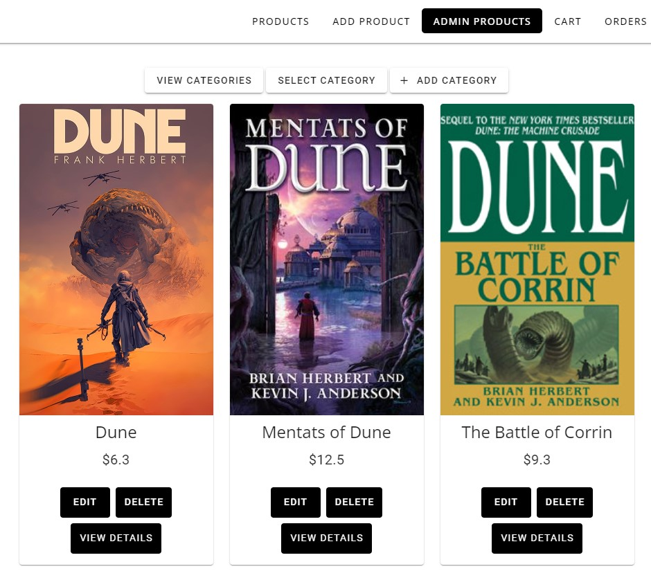
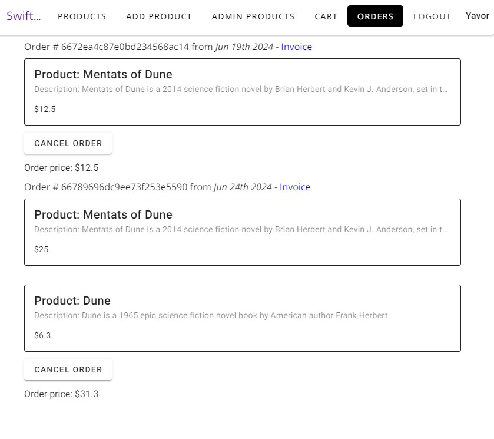
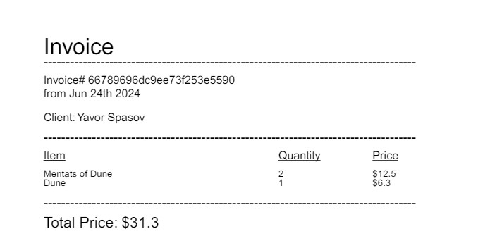
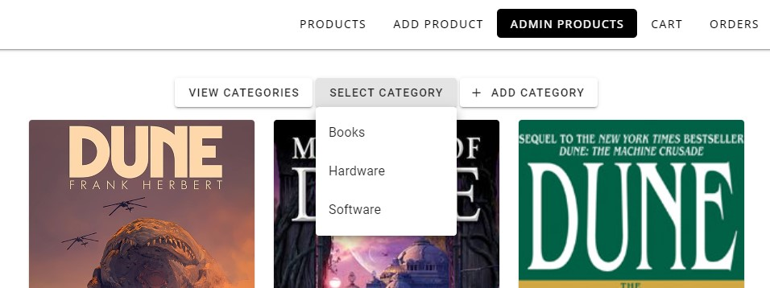
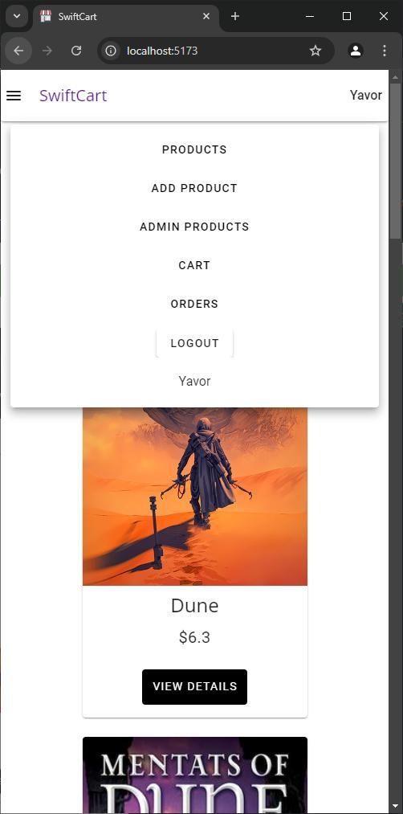

# SwiftCart

SwiftCart is an online shop app built with the MEVN stack.

## Installing and Running the Project

### Installing the Dependencies

```js
npm i
```

### Running the Project

#### Starting the Backend Server

```js
npm run backend
```

#### Starting the Frontend Server

```js
npm run dev
```

## Technologies Used

[VueJS](https://vuejs.org/) - the progressive JavaScript framework

[Vite](https://vitejs.dev/) - next generation frontend tooling

[Vue Router](https://router.vuejs.org/) - the official router for VueJS

[Vuelidate](https://vuelidate-next.netlify.app/) - a lightweight model-based validation for Vue.js

[Vuetify](https://vuetifyjs.com/en/) - an Open Source UI Library with beautifully handcrafted Vue Components

[Pinia](https://pinia.vuejs.org/) - the official store library for VueJS

[Axios](https://axios-http.com/) - a promise based HTTP client for the browser and node.js

[Express](https://expressjs.com/) - a fast, unopinionated, minimalist web framework for Node.js

[Moment](https://momentjs.com/) - a free and open source JavaScript library for handling dates

[MongoDB](https://www.mongodb.com/) - a source-available, cross-platform, document-oriented database program

[Mongoose](https://mongoosejs.com/) - an elegant MongoDB object modeling for Node.js

[PDFKit](https://pdfkit.org/) - a JavaScript PDF generation library for Node and the browser

[Bcrypt](https://www.npmjs.com/package/bcrypt) - a library to help you hash passwords

[Multer](https://www.npmjs.com/package/multer) - a node.js middleware for handling multipart/form-data, which is primarily used for uploading files


## Features

### Authentication

Users can sign up, log in, log out, add products to the shop, and view products of other users, but only edit and delete their own content.

The Sign in and Registration forms use [Vuelidate](https://vuelidate-next.netlify.app/) for validation. All fields show the appropriate errors when the user input doesn't meet the fields' validation criteria. The Sign up and Login buttons only become active when all fields have been validated.


### Adding Products

After a successful login, a user can see their name on the right side of the navbar, and then start adding products. Again, all fields of the form must be validated in order for the "Add Product" button to activate. The user can also upload a photo of the product from their computer.


### Editing and Deleting Products

From the Admin Products section, a user can edit a product. This applies to all data of a product - the name, description, price, and the image. A user can only edit or delete the products that they created.



### Viewing a Single Product

Clicking on "View Details" for an individual product takes the user to a single view for that product. From there, apart from examining the description, the user can also add the chosen product to their shopping cart.


### The Cart

Each time the user adds a product to the cart, they are redirected to the Cart page where they can examine all of their chosen products, view their price, quantity, and the total price of all the items they chose to purchase. It is also possible to adjust the quantity of the each items, which updates the price of that item as well as the cart's total price. A user can remove a product from their cart before ordering.


### Orders

The app keeps track of the orders a user makes. Once they press the Order button on their Cart page, a new order is created for all the items listed in the cart. An order can be canceled at any time, which also removes the information about it from the database.



### Invoicing

Next to each order on the Orders page, there is a link for generating an invoice for that order. It is automatically generated in PDF format and saved by the browser.



### Categories

Through the Admin Products and Products pages, users can add new product categories, view existing categories, or filter products by category. The Add Category option is only available through the Admin Products page and is accessible only to logged-in users.



### Pagination

Currently, the pagination is set to display 6 products per page, and is available at the Products and Admin Products pages.

### Action Notifications

The app displays action notifications for each action the user takes, such as signing in, creating a product, editing a product, removing a product, making an order, or canceling an order.


### Responsive design

The app comes with a responsive design and a hamburger menu.


