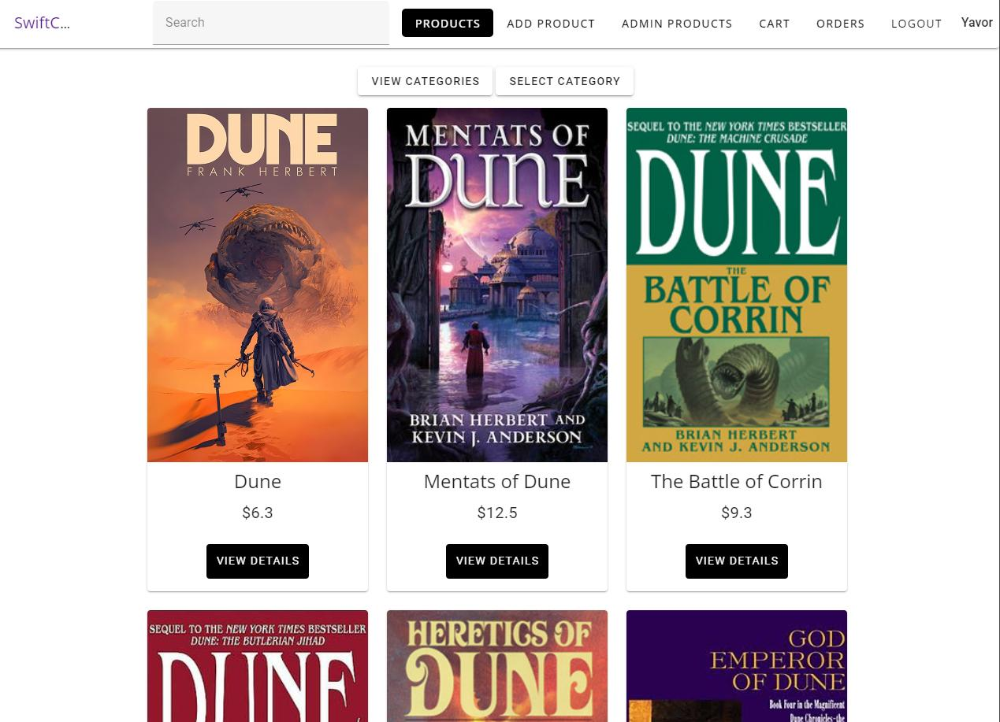

# SwiftCart

# SwiftCart

SwiftCart is an online shop app built with the MEVN stack.

## Installation and running the project

### Installing the dependencies

```js
npm i
```

### Running the project

#### Starting the backend server

```js
npm run backend
```

#### Starting the frontend server

```js
npm run dev
```

## Technologies Used

[VueJS](https://vuejs.org/) - the progressive JavaScript framework

[Vite](https://vitejs.dev/) - next generation frontend tooling

[Vue Router](https://router.vuejs.org/) - the official router for VueJS

[Vuelidate](https://vuelidate-next.netlify.app/) - a lightweight model-based validation for Vue.js

[Vuetify](https://vuetifyjs.com/en/) - an Open Source UI Library with beautifully handcrafted Vue Components

[Pinia](https://pinia.vuejs.org/) - the official store library for VueJS

[Axios](https://axios-http.com/) - a promise based HTTP client for the browser and node.js

[Express](https://expressjs.com/) - a fast, unopinionated, minimalist web framework for Node.js

[Moment](https://momentjs.com/) - a free and open source JavaScript library for handling dates

[MongoDB](https://www.mongodb.com/) - a source-available, cross-platform, document-oriented database program

[Mongoose](https://mongoosejs.com/) - an elegant MongoDB object modeling for Node.js

[PDFKit](https://pdfkit.org/) - a JavaScript PDF generation library for Node and the browser

[Bcrypt](https://www.npmjs.com/package/bcrypt) - a library to help you hash passwords

[Multer](https://www.npmjs.com/package/multer) - a node.js middleware for handling multipart/form-data, which is primarily used for uploading files



## Features

### Authentication

Users can sign up, log in, log out, add products to the shop, view the products of other users, but only edit and delete their own content.

The Sign in and Registration forms use [Vuelidate](https://vuelidate-next.netlify.app/) for validation. All fields show the appropriate errors when the user input doesn't meet the fields' validation criteria. The Sign up and Login buttons only become active when all fields have been validated.


### Adding products

After a successful login, a user can see its name on the right side of the navbar, and then start adding products. Again, all of the fields of the form must be validated in order for the "Add Product" button to activate. The user can also upload a photo of the product from his computer.


### Editing and deleting products

From the Admin Products section, a user can edit a post. This applies to all data of a product - the name, description, price and the image.


### Viewing single product

Clicking on "View Details" for an individual product takes the user to a single view for that product. From there, appart from examining the description, the user also can add a chosen product to his shopping cart


